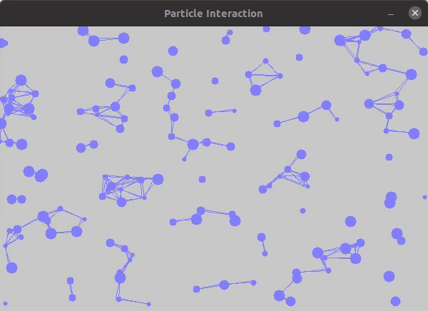

# Particle Network simulation in OpenCV

A visualisation of Particles in C++ using OpenCV library accelerated using OpenMP

## Getting Started

- Clone the repo into your folder

    `https://github.com/sanjeev309/particles.git`

- Make changes if any to main.cpp
- Execute make command to compile into an executable

    `make compile`

- Run the executable

    `./particles`

- Clean for a rebuild

    `make clean`

### Prerequisites

OpenCV 3.2 installation and header files.

### Demonstration

## Built With

* [OpenCV](https://github.com/opencv/opencv/releases/tag/3.2.0) - The Computer Vision Library

## Authors

* **Sanjeev Tripathi** - [LinkedIn](https://www.linkedin.com/in/sanjeev309/)

## License

This project is licensed under the MIT License - see the [LICENSE](https://github.com/sanjeev309/n-body-opencv/blob/master/LICENSE) file for details
